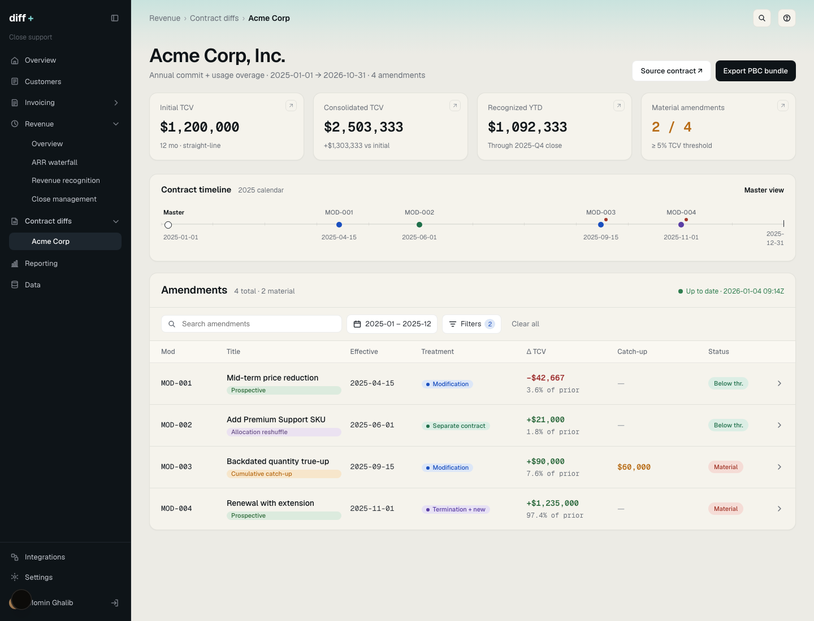
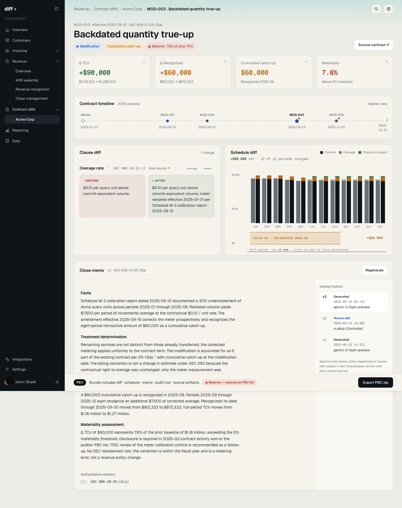
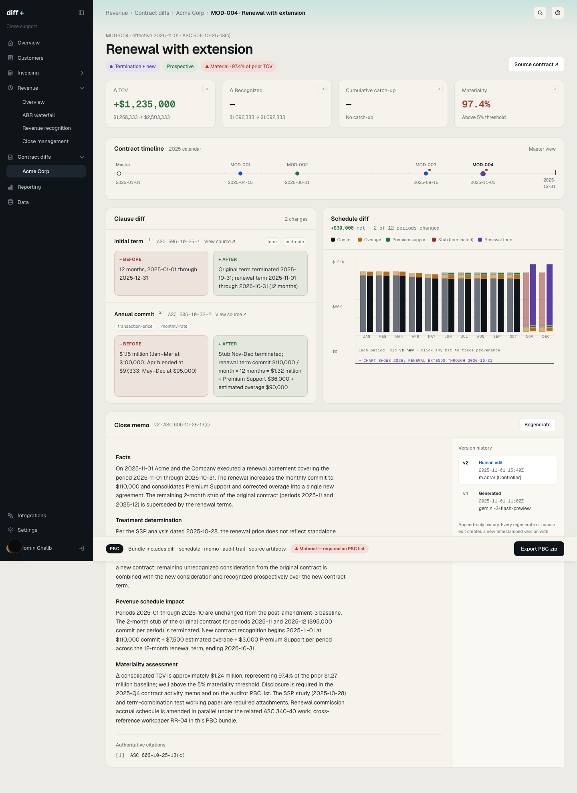
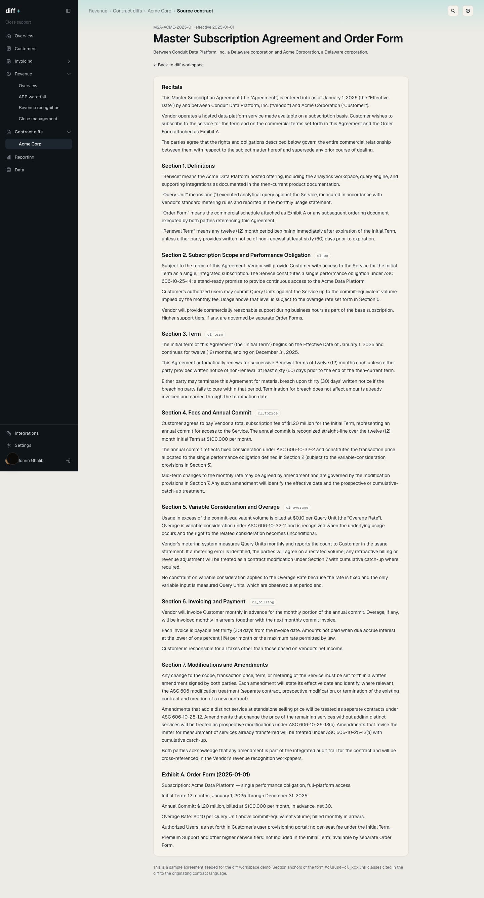
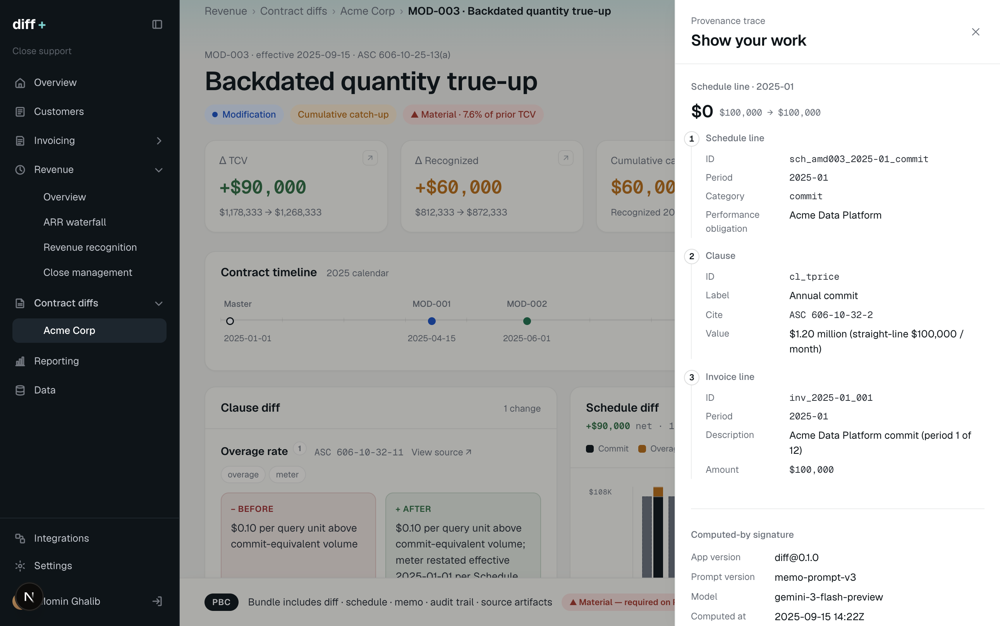
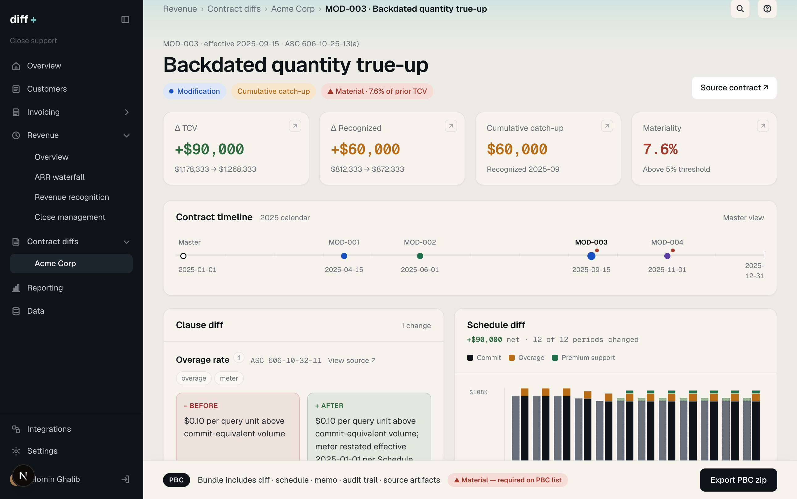

# ASC 606 Mod-Diff Visualizer

A controller-facing workpaper view for contract amendments in usage-based SaaS.

Contract-to-cash platforms already own contract ingestion, usage metering, billing, revenue recognition, and ERP sync. The next controller-grade surface is contract amendment evidence: a diff that shows the contract language, the ASC 606 treatment, the period revenue schedule movement, and the PBC packet a controller can hand to auditors at month-end.



## Contract Pattern

Hybrid commit-plus-consumption (Snowflake-style). The customer prepays an annual minimum commitment against a unit price, draws down against the commit through metered usage, and is billed for overage at the same or a tiered rate once the commit is exhausted. This pattern dominates usage-based SaaS (Snowflake, Databricks, Datadog, Twilio, MongoDB Atlas) and is the contract shape that makes ASC 606 amendment accounting hard: the commit is fixed consideration, overage is variable consideration subject to constraint, and any mid-term change has to be allocated across both.

The demo seeds one Acme Corp contract on this pattern with four Q1 2026 amendments: a mid-term price reduction, an added Premium Support SKU, a backdated metering true-up, and a renewal with extension. Each amendment forces a different ASC 606 treatment.

## What This Is

Single-contract demo for month-end amendment review that sits on top of a computed revenue schedule and makes the controller's judgment legible for other stakeholders including external auditors

- What changed in the contract language.
- Which ASC 606 modification treatment applies.
- Which periods moved and by how much.
- Whether the change creates a cumulative catch-up.
- Which source clause, invoice line, meter, schedule line, prompt version, model version, and input hash support the result.
- What goes into the auditor PBC bundle.

## Why A Contract-To-Cash Company Should Build This

Controllers buy revenue tooling to reduce month-end audit risk. A mid-term amendment can change transaction price allocation, reopen prior periods, trigger a cumulative catch-up, and force the controller to defend the judgment months later.

A contract-to-cash platform owns the facts: contract clauses, usage meters, invoice lines, revenue schedules, ERP sync state. The missing surface is the workpaper that connects those facts into an audit-ready explanation.

This feature would give controllers three things they care about:

- Defensibility: every visible dollar ties back to the contract clause and supporting source artifact.
- Speed: the treatment, materiality flag, and schedule delta are visible before the memo.
- Trust: the memo history is append-only, with model, prompt, timestamp, and input hash attached to every generated version.

## App Walkthrough

### 1. Start From The Contract Overview

Route: `/contracts/acme`

The root route redirects here. The overview shows the controller the state of the Acme contract before selecting a specific amendment:

- Initial total contract value: `$300,000`.
- Consolidated total contract value after all amendments: `$1,703,903`.
- Recognized year-to-date revenue: `$257,903`.
- Material amendments: `2 / 4`.
- A horizontal timeline anchored on the master contract and amendment effective dates.
- A table of all amendments with treatment, impact pattern, TCV delta, catch-up amount, and materiality.

### 2. Drill Into A Cumulative Catch-Up

Route: `/contracts/acme?mod=3`

MOD-003: backdated metering true-up effective `2026-03-01`. Increases TCV by `$22,500`, moves recognized revenue by `$15,000`, crosses the 5% materiality threshold.



The page separates two concepts:

- Accounting treatment: modification of the existing contract under `ASC 606-10-25-13(a)`.
- Revenue impact pattern: cumulative catch-up recognized in `2026-03`.

The left panel shows the clause diff. The right panel shows old versus new period revenue bars. The catch-up appears as its own band beneath the schedule so it does not disappear inside the monthly bars.

### 3. Compare A Termination Plus New Contract Path

Route: `/contracts/acme?mod=4`

MOD-004 covers a renewal and extension effective `2026-03-15`. The remaining 17 days of original-term March are terminated, and a new 12-month renewal term runs through `2027-03-14`.



- Treatment: termination of the existing contract plus creation of a new contract under `ASC 606-10-25-13(c)`.
- Impact pattern: prospective recognition under the renewal term.
- Materiality: ~440% of prior TCV.
- Workpaper need: SSP analysis and term-combination support belong in the PBC packet.

### 4. Jump Back To The Source Contract

Route: `/contracts/acme/document`

The source contract route renders the seeded agreement with stable clause IDs. Clause diff links jump to these anchors, so the controller can move from a changed field back to the originating language.



Source clause stays reachable from any diff link.

### 5. Open The Provenance Trace

Click a schedule bar or trace marker.



The drawer explains how a visible number was computed:

- Schedule line ID.
- Performance obligation.
- Clause ID and ASC 606 cite.
- Invoice line or usage meter.
- App version.
- Prompt version.
- Model version.
- Computed timestamp.
- Input hash.

Auditors ask how the answer was produced.

### 6. Export The PBC Bundle

Click `Export PBC zip`.



In `v0.1`, the export button is a no-op with a toast. The intended bundle contents are already reflected in the UI contract:

- Clause diff.
- Schedule diff.
- Close memo.
- Version history.
- Audit trail.
- Source artifacts.

For material amendments, the footer marks the bundle as required on the PBC list.

## Gold Contract Scenario

| Mod | Effective date | Scenario | ASC 606 treatment | Revenue pattern | Controller signal |
|---|---:|---|---|---|---|
| MOD-001 | 2026-01-15 | Mid-term price reduction | Modification | Prospective | TCV decreases `$12,742`, below threshold |
| MOD-002 | 2026-02-01 | Add Premium Support SKU | Separate contract | Allocation reshuffle | TCV increases `$6,000`, original schedule unchanged |
| MOD-003 | 2026-03-01 | Backdated quantity true-up | Modification | Cumulative catch-up | `$15,000` catch-up, material |
| MOD-004 | 2026-03-15 | Renewal with extension | Termination plus new contract | Prospective | TCV increases `$1,388,145`, material |

## Feature Inventory

| Surface | What it proves |
|---|---|
| Contract overview | A controller can scan all amendments without reading every memo. |
| Contract timeline | Treatment and effective date stay visible across the workflow. |
| Clause diff | Changed commercial terms are shown before the generated narrative. |
| Schedule diff | Revenue movement is period-specific and dollar-specific. |
| Catch-up band | Prior-period impact is not buried inside the chart. |
| Close memo | The memo states facts, treatment, schedule impact, materiality, and ASC 606 citations. |
| Version history | Generated and human-edited memo versions remain readable. |
| Provenance trace | Visible numbers trace back to clause, invoice, meter, and computed-by metadata. |
| Source contract | Clause anchors keep the workpaper tied to source language. |
| PBC footer | The workflow ends in auditor evidence, not a dashboard. |

## Implementation

This repo is a Next.js App Router app with TypeScript and Bun.

Key files:

| Path | Purpose |
|---|---|
| `app/page.tsx` | Redirects to the Acme contract workspace. |
| `app/contracts/[slug]/page.tsx` | Main contract overview and amendment drill-in route. |
| `app/contracts/[slug]/document/page.tsx` | Source contract route with clause anchors. |
| `app/lib/gold-contract.ts` | Seeded contract, invoice lines, schedule lines, amendments, and memo versions. |
| `app/lib/materiality.ts` | TCV delta, recognition delta, and 5% materiality logic. |
| `app/components/diff-workspace.tsx` | Clause diff, schedule diff, close memo, PBC footer, and provenance drawer composition. |
| `app/components/close-memo.tsx` | Memo rendering, append-only version selector, and regeneration action. |
| `app/api/amendments/[id]/memo/route.ts` | Memo regeneration endpoint. |
| `app/lib/gemini.ts` | Google GenAI integration for memo generation. |
| `prompts/close-memo-system.md` | Controller-voice memo prompt. |

Memo regeneration requires `GEMINI_API_KEY`. The seeded memo versions render without an API key.

## Run Locally

```bash
bun install
bun run dev
```

Open:

```text
http://localhost:3000/contracts/acme
```

Useful checks:

```bash
bun run typecheck
bun run build
```

## Out Of Scope

- Multi-tenant auth.
- Real customer data.
- ERP push or pull.
- Contract ingestion.
- Multi-contract dashboards.
- GL impact preview.
- Exception inbox.
- Signoff workflow.
- Live PBC zip generation.

Scope: produce audit-ready evidence when an amendment lands.
