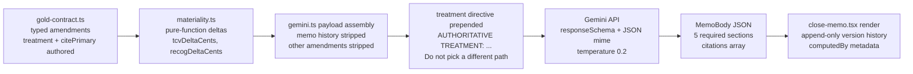

# ASC 606 Mod-Diff Visualizer

A controller-facing workpaper for ASC 606 contract amendments in usage-based SaaS. Contract-to-cash platforms ship the engine: ingestion, metering, billing, recognition, ERP sync. The gap is the artifact a controller hands to an external auditor at month-end. The diff that ties changed contract language to the 606 treatment, the period revenue movement, the materiality flag, and the supporting source. This demo builds that artifact and constrains the LLM to a single job: narrate one amendment as a controller would, given pre-computed structured facts. Treatment classification, dollar deltas, and materiality are deterministic and authored upstream. Schema-constrained JSON output, treatment lock-in directive, citation whitelist, and append-only memo history form a four-layer defense against the failure modes that make generic 606 memos unusable in a PBC bundle.

## Workpaper Gap

Controller persona: month-end close at a Series B/C usage-based SaaS company. Snowflake-style contracts (annual commit + usage overage). The commit is fixed consideration; overage is variable consideration subject to constraint. Any mid-term change forces reallocation across both.

Contract-to-cash platforms (Tabs, Maxio, Zuora, RightRev, NetSuite) ship the engine. None ship the amendment workpaper: the diff that proves to an external auditor which 606 path was taken, which periods moved, and why.

Acme Corp seed on the commit-plus-consumption pattern. Four Q1 2026 amendments cover four distinct ASC 606 treatments:

| Amendment | Treatment | Pattern | Materiality |
|---|---|---|---|
| MOD-001: Mid-term price reduction | Modification under 25-13(b) | Prospective | 4.2% (below 5% threshold) |
| MOD-002: Premium Support SKU | Separate contract under 25-12 | Allocation reshuffle | 2.0% (below threshold) |
| MOD-003: Backdated metering true-up | Modification under 25-13(a) | Cumulative catch-up | 7.7% (material) |
| MOD-004: Renewal with extension | Termination + new contract under 25-13(c) | Prospective | ~440% (material) |

Eval ground truth: every memo must surface its row's treatment, pattern, and materiality verbatim.

## Grounding Architecture

Structured-input grounding: the model receives pre-computed facts as typed JSON and narrates them under constraints.



**Context discipline** (`gemini.ts:59-60`): memo history and other amendments stripped before serialization. Payload contains the current amendment plus master contract metadata.

**Treatment directive** (`gemini.ts:92-107`): `"AUTHORITATIVE TREATMENT: {treatment}. Citation: {citePrimary}. Required phrasing: {phrasing}. Justify this classification from the supplied facts. Do not pick a different ASC 606 path."`

**Numerical grounding** (`app/lib/materiality.ts:17-23`): all dollar amounts travel as integer cents. Conversion to dollars happens at the prompt boundary and in the UI.

## Failure Mode Taxonomy

Eight failure modes, each with a code-pathed mitigation:

| Failure | Mitigation | Code Path |
|---|---|---|
| Treatment hallucination | Authoritative-treatment directive prepended to user message | `gemini.ts:92-107` |
| Citation invention | "Do not cite paragraphs that do not appear in the input" + `citePrimary` lock | `close-memo-system.md:42-44` |
| Voice drift | 12 voice rules in system prompt; voice scored as eval dimension | `close-memo-system.md:15-23` |
| Dollar drift | Cents as integer input; per-cent conversion rule; hard-fail eval dimension | `close-memo-system.md:25-30` |
| Entity invention | Explicit prohibition + hard-fail on hallucinated names/IDs | `close-memo-system.md:59`, `evals.md:16` |
| Format drift | `responseSchema` + `responseMimeType: "application/json"` | `gemini.ts:77-78` |
| Reasoning leakage | Hard-fail in eval rubric; schema constraint blocks free text | `evals.md:19` |
| Scope drift | "Scope is exactly one amendment" system prompt rule | `close-memo-system.md:57` |

## Eval Methodology

Offline rubric defined in [`prompts/close-memo-evals.md`](prompts/close-memo-evals.md). Six dimensions scored 0-2:

| Dimension | Must-pass | What "passes" means |
|---|---|---|
| Treatment classification | Yes | Names correct 606-10-25 path, cites `citePrimary`, justifies from supplied facts |
| Dollar precision | Yes | Every dollar matches input cents exactly when converted; no rounding without reason |
| Period-by-period schedule impact | Yes | Names which periods change, dollar amount per period, cumulative catch-up by month |
| Materiality assessment | Yes | Absolute and relative stated, compared to 5% threshold, disclosure requirement unambiguous |
| Citation hygiene | No | Every `[n]` marker resolves in citations array; no invented paragraph numbers |
| Voice | No | Controller register. No hedging, first-person, or AI tells |

**Ship threshold**: total score at least 9/12 with no zero on any must-pass dimension.

**Hard-fail conditions** (auto-reject regardless of score):

- Hallucinated invoice number, working paper ID, counterparty, or ASC paragraph not in input
- Disagrees with the input's authoritative `treatment` field
- Greeting, signoff, or addressee line
- Reasoning visible in output ("Let me think...", "Step 1...")
- Markdown fences or wrapper around the JSON

**Run protocol**: any change to `prompts/close-memo-system.md` requires re-running all four amendments through the rubric before merge.

**Online eval**: not implemented. Rubric runs by hand against the four seeded amendments; production would log per-regeneration scores.

## Hallucination and Safety Reduction

Four-layer defense:

**1. Input layer**: numbers from `materiality.ts`, treatment and `citePrimary` from `gold-contract.ts`. The LLM receives structured JSON with cents-as-integers, absolute dates, and pre-resolved treatment.

**2. Prompt layer**: treatment directive locks the 606 path. Voice rules prohibit hedging, first-person, AI tells. Citation discipline: "Do not cite paragraphs that do not appear in the input. Do not invent paragraph numbers." Entity prohibition: no invented invoice numbers, working paper IDs, or counterparty names.

**3. Schema layer**: `responseSchema` (`gemini.ts:14-48`) defines five required string sections plus a citations array with required `marker` and `cite` fields. `responseMimeType: "application/json"` (`gemini.ts:77`) blocks markdown wrappers and free-text preambles.

**4. Audit layer**: append-only memo history (`MemoVersion` in `types.ts:56-67`) with `priorVersionId` linking. Per-amendment `computedBy` signature carries `appVersion`, `promptVersion`, `modelVersion`, `computedAt`, and `inputHash` (`types.ts:94-100`). Schedule-line foreign keys (`clauseId`, `meterId`, `invoiceLineId`) enable chain-of-custody tracing in `provenance-trace.tsx:149-228`.

**Known gaps**:

- `inputHash` in computedBy is populated from seed fixture data, not computed at runtime from the actual generation input
- `auditTrail` referenced in the PBC bundle footer is a planned export artifact, not an implemented data structure
- Persistence is `localStorage`; single-session demo, not a production system

## Cost, Latency, and Quality Tradeoffs

Rationale only; no production telemetry exists:

**`gemini-3-flash-preview` over Pro tier**: treatment classification is locked upstream; the model narrates and justifies. Flash is sufficient and serves an interactive regenerate flow.

**Temperature 0.2** (`gemini.ts:79`): ASC 606 memos need consistency across regenerations. Trades phrasing variance for reliability on dollar figures and citation placement.

**`responseSchema` over free text**: schema tokens cost less than parse-failure recovery, and the UI can render typed sections without a tolerant parser.

**Pre-computed dollars over LLM-derived**: every number traces to an integer-cents input field. Audit defensibility requires it.

**No `maxOutputTokens` cap**: known gap. Production should bound cost per generation.

## Implementation

| Path | Purpose |
|---|---|
| `app/lib/gold-contract.ts` | Seeded contract, amendments, schedule lines, and memo versions as typed constants |
| `app/lib/materiality.ts` | Pure-function TCV delta, recognition delta, and 5% materiality threshold |
| `app/lib/gemini.ts` | Payload assembly, treatment directive, Gemini API call with responseSchema |
| `prompts/close-memo-system.md` | System instruction: voice rules, numerical discipline, citation whitelist |
| `prompts/close-memo-evals.md` | Offline eval rubric: 6 dimensions, hard-fails, per-amendment expected facts |
| `app/components/close-memo.tsx` | Memo render, version selector, regeneration action, localStorage persistence |

## Run Locally

```bash
bun install
bun run dev
```

Open `http://localhost:3000/contracts/acme`.

Memo regeneration requires `GEMINI_API_KEY` set in `.env.local`. Seeded memo versions render without an API key.

```bash
bun run typecheck
bun run build
```

## Out Of Scope

- Multi-tenant auth, real customer data, ERP push/pull, contract ingestion
- Multi-contract dashboards, GL impact preview, exception inbox, signoff workflow
- Live PBC zip generation, online eval, role-based edit permissions
- ML amendment classification (treatments are authored constants in this demo)
